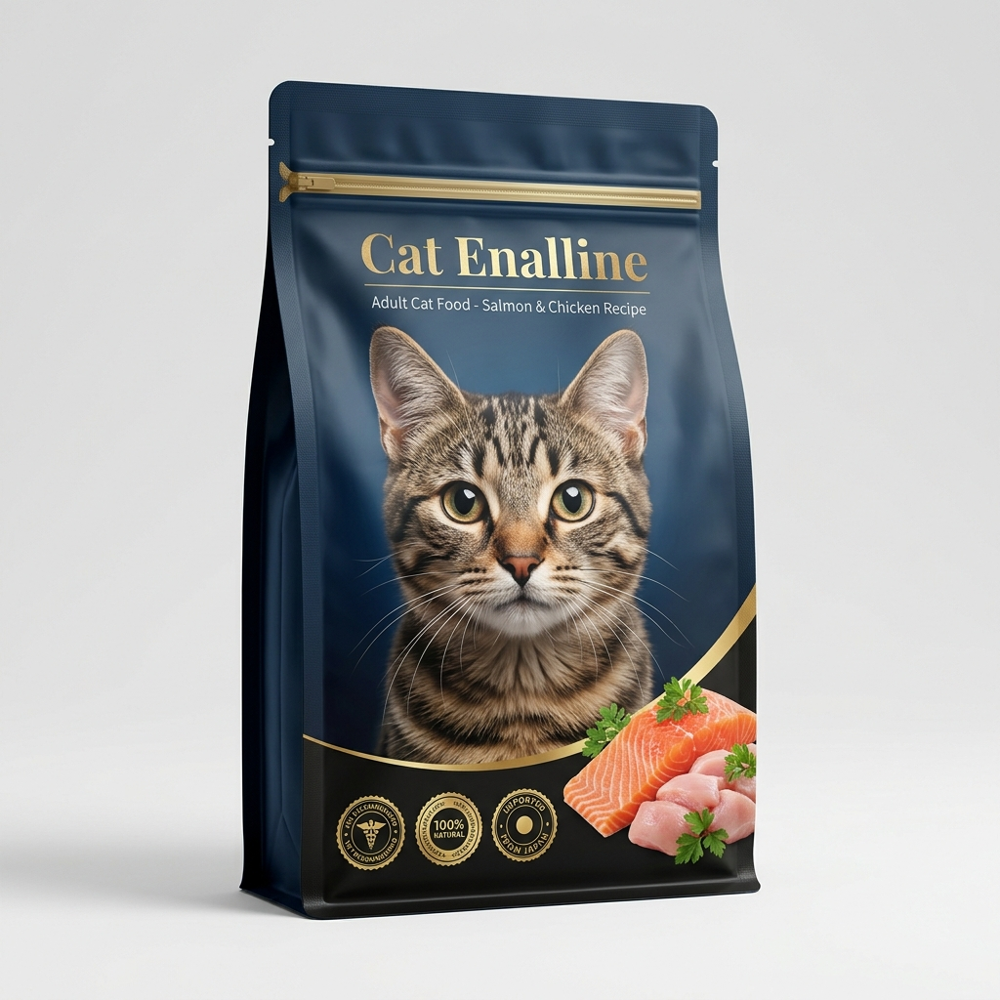

# 🎨 Packaging Redesign & Design Brief

**สำหรับ "Option 3" (Silent Salesman)**

จากการวิเคราะห์ด้วย Machine Learning (Feature Importance จาก Random Forest Model) ปัจจัยที่มีผลต่อการติดสินใจซื้อมากที่สุด (Top Drivers) เรียงตามลำดับ ได้แก่:

1. `packaging_13`: มีภาพแมวบนบรรจุภัณฑ์
2. `packaging_12`: บรรจุภัณฑ์ดูดีพรีเมียม
3. `packaging_19`: มีการการันตี (รางวัล, สัตวแพทย์แนะนำ)
4. `packaging_17`: มีสัญลักษณ์สื่อถึงแหล่งผลิต (เช่น นำเข้าจากญี่ปุ่น)

---

## 📝 Design Brief (สำหรับส่งให้ Graphic Designer)

**Project Name:** Cat Food Packaging Redesign (Project Silent Salesman)
**Objective:** ปรับปรุงบรรจุภัณฑ์ให้โดดเด่นบนเชลฟ์ (Shelf Impact) และเพิ่มอัตราการหยิบซื้อ (Purchase Intent) จากกลุ่มลูกค้าที่รักแมวเหมือนลูก

### 1. Visual Elements (องค์ประกอบภาพ)

- **Hero Image:** ต้องมีภาพแมวจริง (Real Cat) หรือภาพแมวเสมือนจริงที่ดูน่ารัก สุขภาพดี และมีสายตาดึงดูด (Eye-contact) มองมาที่ผู้ซื้อ ภาพแมวคือ "แม่เหล็ก" ชิ้นแรกที่ดึงดูดสายตาบนเชลฟ์
- **Ingredient Showcase:** บริเวณมุมขวาล่างหรือใกล้ชามอาหาร ควรมีภาพวัตถุดิบจริง (เช่น ชิ้นปลาแซลมอน, เนื้อไก่สด) เพื่อสื่อถึงคุณภาพ
- **Color Palette:** ใช้โทนสีที่สื่อถึงความ **"พรีเมียม (Premium)"** เช่น การใช้สีพื้นฐานแบบ Deep Blue, Emerald Green หรือ Matte Black ตัดกับฟอยล์สีทอง/เงิน ในบางจุดเพื่อสร้างมิติความหรูหรา

### 2. Functional & Information Design (การจัดวางข้อมูล)

- **Trust Badges (ส่วนการันตี):** ต้องมีตราประทับ (Seal/Badge) บริเวณที่เห็นได้ชัดเจนที่หน้าซอง เช่น
  - _"Vet Recommended"_ (สัตวแพทย์แนะนำ)
  - _"100% Natural Ingredients"_
  - ธงชาติหรือสัญลักษณ์ประเทศแหล่งผลิต (เช่น _"Imported from Japan"_)
- **Clear Benefits:** ใช้ไอคอน (Iconography) สื่อสารฟังก์ชัน เช่น รูปกระดูก (บำรุงข้อต่อ) รูปหัวใจ (บำรุงขน) เพื่อให้ลูกค้าอ่านจบได้ใน 3 วินาที

### 3. Structural Design (โครงสร้างบรรจุภัณฑ์)

- **Ziplock:** ใช้วัสดุที่สามารถปิดผนึกได้ (Resealable Ziplock) เพื่อรักษาความสดใหม่ของรสชาติอาหาร (ตอบโจทย์ Insight เรื่องรสชาติความอร่อย)
- **Material:** ใช้วัสดุเนื้อด้าน (Matte finish) แทนเนื้อเงาพลาสติกทั่วไป เพื่อยกระดับสัมผัสเวลาหยิบจับให้รู้สึกแพงและพรีเมียมมากขึ้น

---

## 💡 Shelf Impact Strategy

เมื่อนำบรรจุภัณฑ์ไปวางบนเชลฟ์ (Shelf) เทียบกับคู่แข่ง:

1. **Color Blocking:** สีของแบรนด์เรา (เช่น สีเนื้อด้านพรีเมียม) จะแตกต่างจากแบรนด์ Mass ทั่วไปที่มักใช้สีเหลือง แดง หรือส้มสด
2. **Eye-level Engagement:** ภาพแมวบนซองจะถูกจัดวางในตำแหน่งที่สบตากับผู้ซื้อในระดับสายตา (Eye-level)
3. **The "3-Second Rule":** Badge รับรองคุณภาพและความพรีเมียมจะถูกกวาดสายตาเห็นภายใน 3 วินาทีแรก ทำให้ลูกค้าเกิดความเชื่อใจ (Trust) ทันทีโดยไม่ต้องพลิกอ่านด้านหลังซอง
