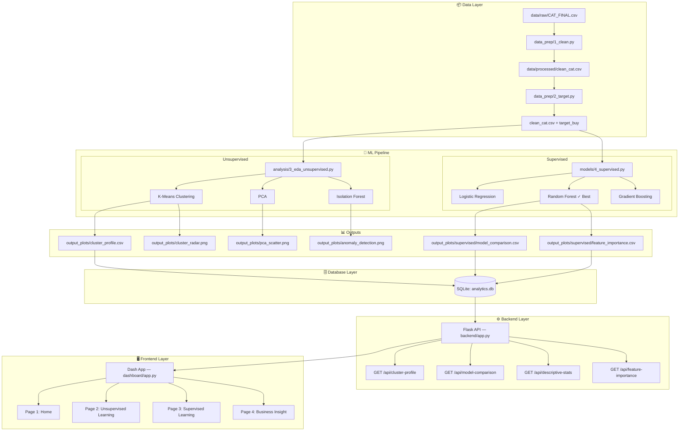

# System Architecture — Project Silent Salesman

## Architecture Diagram

---

## Component Breakdown

### Data Layer
| File | Role |
|---|---|
| `data/raw/CAT_FINAL.csv` | Raw survey export — read-only |
| `data_prep/1_clean.py` | Cleaning, encoding, missing value handling |
| `data_prep/2_target.py` | Creates binary `target_buy` variable |
| `data/processed/clean_cat.csv` | Clean, model-ready dataset |

### ML Layer
| File | Techniques | Outputs |
|---|---|---|
| `analysis/3_eda_unsupervised.py` | K-Means, PCA, Isolation Forest | cluster_profile.csv, plots |
| `models/4_supervised.py` | LR, RF, GB + cross-validation | model_comparison.csv, feature_importance.csv |

### Database Layer
| File | Role |
|---|---|
| `backend/db.py` | SQLite init + CSV import |
| `backend/analytics.db` | Tables: cluster_results, model_results, feature_importance, anomaly_summary |

### Backend Layer
| Endpoint | Returns |
|---|---|
| `GET /api/cluster-profile` | Cluster means per feature |
| `GET /api/model-comparison` | Model metrics (F1, Accuracy, AUC) |
| `GET /api/descriptive-stats` | Feature statistics |
| `GET /api/feature-importance` | Feature importance ranking |

### Frontend Layer
| Page | Path | Content |
|---|---|---|
| Home | `/` | Project overview, team, quick stats |
| Unsupervised | `/unsupervised` | Clustering, PCA, Anomaly KPIs + charts |
| Supervised | `/supervised` | Model comparison, Feature Importance KPIs + charts |
| Business Insight | `/business-insight` | Segment strategy, design brief, recommendations |

---

## Tech Stack

| Layer | Technology |
|---|---|
| Language | Python 3.x |
| Dashboard | Plotly Dash + dash-bootstrap-components |
| API | Flask |
| Database | SQLite (via Python sqlite3) |
| ML | scikit-learn, pandas, numpy |
| Visualization | Plotly, matplotlib (pre-generated) |
